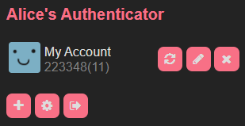

# Alice's Authenticator

Yet another time-based one time password (TOTP) browser extension.  The fancy feature this one has is that it can insert codes directly in to web pages (with some setup)!

# Other Funky Features
- Everything's stored by the browser in encrypted + password protected flavour
- Supports 6 or 8 digits and custom code expiry time
- Can scan otpauth QR codes from images (like the ones provided by Microsoft, or generated using [this](https://stefansundin.github.io/2fa-qr/))
- Each time you open the extension you get a new colour scheme

# Installation and Usage
This extension currently isn't on any extension store.  To install it, clone this repo, and perform the instructions for your browser:

### Chrome
Go to the extensions page, and in the top right, click "Developer mode".  At the top left, click "load unpacked", and select this repo's folder.

### Edge
Go the extensions page, and on the pane on the left, click "Developer mode".  In the top right, click "load unpacked", and select this repo's folder.

### Firefox
**Note** On Firefox, when you open a file dialog for loading images or importing profiles, it closes the extension popup.
Go to the extension page, and click the settings gear in the top right.  Click "Debug add-ons".  Click "Load Temporary Add-On" and select the file in this repo called "manifest.json".  This will only temporarily add the extension, and it will be removed when you close the browser.

# Credits
- [Web Extension browser API polyfill](https://github.com/mozilla/webextension-polyfill) by Mozilla
- [jsOTP](https://github.com/jiangts/JS-OTP) by jiangts
- [crypto-js](https://github.com/brix/crypto-js) by brix
- [jsQR](https://github.com/cozmo/jsQR) by cozmo
- [optauth-uri-parser](https://gitlab.com/dominicp/otpauth-uri-parser) by Dominic